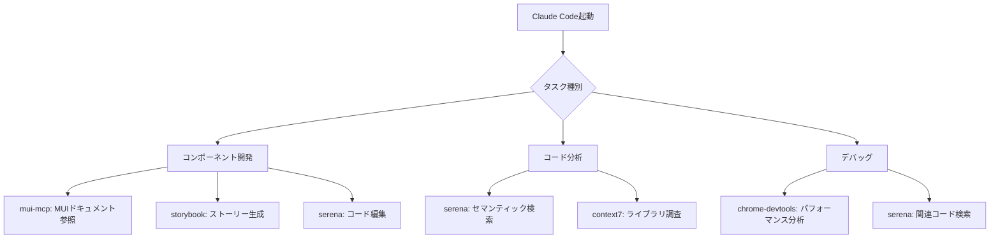

# MCP設定状況レポート

最終更新: 2026-02-02

## 現在の稼働状況

### ✅ 稼働中のMCPサーバー

| サーバー名           | 説明                       | 状態     | 用途                                               |
| :------------------- | :------------------------- | :------- | :------------------------------------------------- |
| **context7**         | ライブラリドキュメント取得 | ✓ 接続済 | 最新のライブラリドキュメントとコード例を動的に取得 |
| **serena** (plugin)  | セマンティックコード分析   | ✓ 接続済 | IDE統合用のコード理解と編集支援                    |
| **serena** (project) | プロジェクト固有のSerena   | ✓ 接続済 | sdpf-theme専用のコード分析                         |
| **mui-mcp**          | Material-UI v7ドキュメント | ✓ 接続済 | MUI v7の公式ドキュメントとコンポーネント情報       |
| **storybook**        | Storybook統合              | ✓ 接続済 | コンポーネントストーリーとスクリーンショット       |
| **chrome-devtools**  | ブラウザデバッグ支援       | ✓ 接続済 | パフォーマンス分析とデバッグ                       |
| **pencil**           | デザインツール             | ✓ 接続済 | .penファイルのデザイン操作                         |

### ❌ 未接続のMCPサーバー

| サーバー名             | 状態       | 理由                           | 対応方針                               |
| :--------------------- | :--------- | :----------------------------- | :------------------------------------- |
| **GitHub Copilot MCP** | ✗ 接続失敗 | 認証エラーまたはサービス未利用 | 必要性を確認後、削除または修正         |
| **figma-desktop**      | ✗ 接続失敗 | Figmaデスクトップアプリ未起動  | オプションとして維持（必要時のみ起動） |

### ⚠️ 認証が必要なMCPサーバー

| サーバー名         | 状態       | 対応方法                                         |
| :----------------- | :--------- | :----------------------------------------------- |
| **figma** (remote) | ⚠ 認証必要 | Claude Codeで`/mcp`→`figma`→`Authenticate`で認証 |

## MCP活用状況

### 開発フロー統合



### 実際の使用例

#### 1. MUIコンポーネント開発時

```text
開発者: "Grid v7の新しいsizeプロパティの使い方を教えて"
↓
mui-mcp: MUI公式ドキュメントから最新情報を取得
↓
Claude: 正確なコード例と説明を提供
```

#### 2. 既存コード分析時

```text
開発者: "テーマのカスタマイズロジックはどこにある?"
↓
serena: セマンティック検索でテーマ関連コードを特定
↓
Claude: 該当ファイルと関連コードを提示
```

#### 3. ライブラリ最新情報取得時

```text
開発者: "React hooksのTypeScript使用方法を教えて。use context7"
↓
context7: 最新のReact公式ドキュメントを取得
↓
Claude: バージョン固有の正確な情報を提供
```

## .serena/project.yml について

### ファイルの役割

`.serena/project.yml`はSerena MCPサーバーのプロジェクト固有設定ファイルです。

### 設定内容

```yaml
languages:
  - typescript

encoding: 'utf-8'

ignore_all_files_in_gitignore: true

ignored_paths: []

read_only: false

excluded_tools: []

project_name: 'sdpf-theme'
```

### 重要性

- **必須ファイル**: Serenaが正しく動作するために必要
- **TypeScript言語サーバー設定**: TypeScriptプロジェクトとして認識
- **Git統合**: .gitignoreに基づくファイル除外
- **プロジェクト識別**: `sdpf-theme`として識別

### 推奨事項

✅ **このファイルは保持してください**

- Gitにコミットして共有推奨
- プロジェクトメンバー全員が同じ設定を使用
- Serenaの正確な動作に必要

## 推奨される追加MCPサーバー

### 現在未導入だが有用なもの

| サーバー名         | 用途                 | 優先度 | インストールコマンド                                                          |
| :----------------- | :------------------- | :----- | :---------------------------------------------------------------------------- |
| **GitHub MCP**     | GitHubリポジトリ操作 | 中     | `claude mcp add github -- npx -y @modelcontextprotocol/server-github`         |
| **Filesystem MCP** | ファイルシステム操作 | 低     | `claude mcp add filesystem -- npx -y @modelcontextprotocol/server-filesystem` |

### 検討中

- **Slack MCP**: チーム通知統合（必要に応じて）
- **Jira MCP**: タスク管理統合（必要に応じて）

## 最適化提案

### 1. 未使用サーバーの整理

```bash
# GitHub Copilot MCPが不要な場合
claude mcp remove plugin:github:github

# figma-desktopが不要な場合（リモートfigmaのみ使用）
claude mcp remove plugin:figma:figma-desktop
```

### 2. Context7 APIキーの設定

無料版で動作していますが、APIキーを設定するとフル機能が利用可能：

```bash
# Upstash Console (https://console.upstash.com/) でAPIキーを取得後
claude mcp add context7 -- npx -y @upstash/context7-mcp --api-key YOUR_API_KEY
```

### 3. Figma認証の完了

デザインからコード生成が必要な場合：

```bash
# Claude Codeで実行
/mcp
# → figma を選択
# → Authenticate をクリック
# → Allow Access
```

## トラブルシューティング

### MCPサーバーが認識されない

```bash
# 1. Claude Codeを再起動
# 2. 設定確認
claude mcp list

# 3. 設定ファイル確認
cat ~/.config/claude/mcp.json
```

### Serenaの接続エラー

```bash
# uvが正しくインストールされているか確認
which uv
uv --version

# 再インストール
curl -LsSf https://astral.sh/uv/install.sh | sh
source $HOME/.local/bin/env
```

### パフォーマンス問題

- レスポンスサイズが大きい場合: より具体的なクエリを使用
- 多数のMCPサーバー起動時: 不要なサーバーを無効化

## 参考資料

- [MCP_SETUP.md](./.MCP_SETUP.md) - MCPサーバーのインストールガイド
- [Claude Code MCP公式ドキュメント](https://code.claude.com/docs/en/mcp)
- [Serena GitHub](https://github.com/oraios/serena)
- [Context7 Documentation](https://github.com/upstash/context7)
