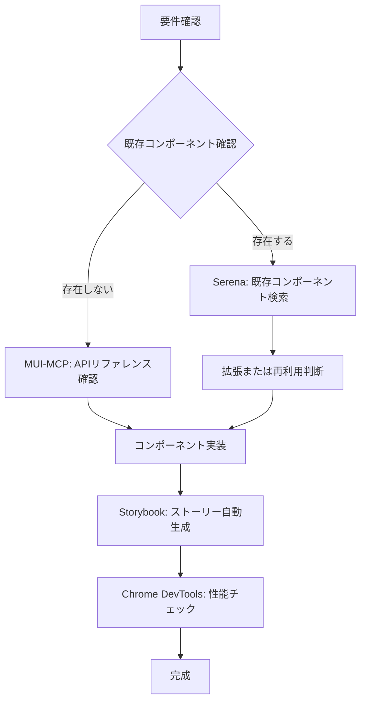
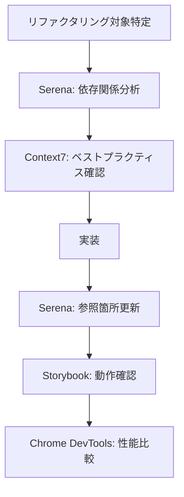
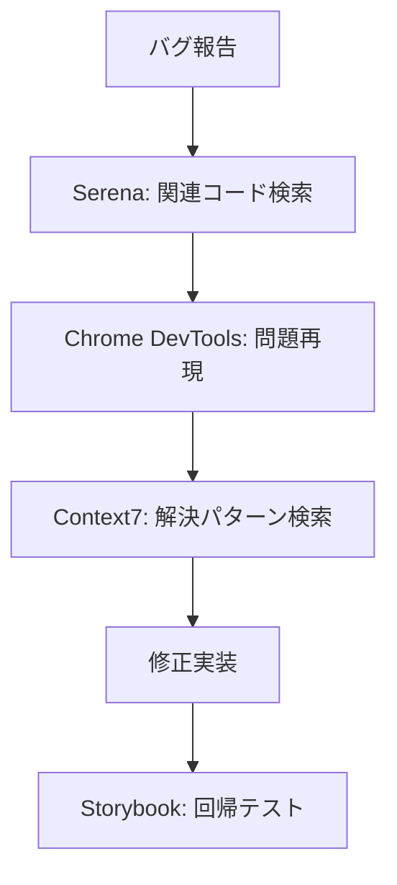

# MCP活用ガイド - 実践編

最終更新: 2026-02-02

このガイドは、sdpf-themeプロジェクトで利用可能なMCPサーバーの具体的な活用方法を示します。

## 目次

1. [MUI-MCP: Material-UI v7ドキュメント参照](#1-mui-mcp-material-ui-v7ドキュメント参照)
2. [Serena: セマンティックコード分析](#2-serena-セマンティックコード分析)
3. [Storybook-MCP: コンポーネントストーリー管理](#3-storybook-mcp-コンポーネントストーリー管理)
4. [Context7: 最新ライブラリドキュメント](#4-context7-最新ライブラリドキュメント)
5. [Chrome DevTools MCP: パフォーマンス診断](#5-chrome-devtools-mcp-パフォーマンス診断)
6. [実践的なワークフロー例](#6-実践的なワークフロー例)

---

## 1. MUI-MCP: Material-UI v7ドキュメント参照

### 基本的な使い方

#### コンポーネント情報の取得

```text
プロンプト: "Grid v7の新しいsizeプロパティの使い方を教えて"
```

Claude Codeが自動的にMUI-MCPを使用して最新のドキュメントを取得し、正確なコード例を提供します。

#### カスタマイズ方法の確認

```text
プロンプト: "Buttonコンポーネントのテーマカスタマイズ方法は?"
```

#### 実践例：新しいGrid APIの学習

**Before（古いAPI - 使用禁止）:**

```tsx
<Grid container spacing={2}>
  <Grid item xs={12} sm={6} md={4}>
    <Card>...</Card>
  </Grid>
</Grid>
```

**After（新しいAPI - MUI v7推奨）:**

```tsx
<Grid container spacing={2}>
  <Grid size={{ xs: 12, sm: 6, md: 4 }}>
    <Card>...</Card>
  </Grid>
</Grid>
```

### よくある質問パターン

| 質問                                              | 期待される回答                         |
| :------------------------------------------------ | :------------------------------------- |
| "Gridコンポーネントのブレークポイント設定方法は?" | 新しいsize propの使い方と具体例        |
| "Stackコンポーネントの使い方は?"                  | direction、spacing、alignItemsの設定例 |
| "テーマのカラーパレット設定方法は?"               | createTheme()の使い方と型定義          |

### Tips

- **具体的なコンポーネント名を指定**: "MUIのレイアウト"よりも"Grid"と指定した方が正確
- **バージョンを明示**: "MUI v7"と明記すると最新情報が得られます
- **プロジェクト固有の制約を伝える**: "React.FC禁止で実装して"と指定可能

---

## 2. Serena: セマンティックコード分析

### 基本的な使い方

#### コードベース全体から機能を検索

```text
プロンプト: "テーマのカスタマイズロジックはどこにある?"
```

Serenaがセマンティック検索を実行し、関連ファイルとコードスニペットを提供します。

#### シンボル（関数・クラス）の検索

```text
プロンプト: "createTheme関数の使用箇所を全て見つけて"
```

#### 実践例：既存コンポーネントの拡張

**シナリオ**: Buttonコンポーネントに新しいvariantを追加したい

```text
1. "Buttonコンポーネントの実装を見せて"
   → Serenaが該当ファイルを特定

2. "このButtonコンポーネントを使用している箇所は?"
   → Serenaが参照箇所を列挙

3. "新しいvariant 'outlined-danger'を追加して"
   → Claude Codeが既存パターンに従って実装
```

### よくある活用パターン

#### パターン1: 類似機能の発見

```text
"既存のカードコンポーネントはある?"
```

重複実装を避けるために、まず既存コンポーネントを確認します。

#### パターン2: 依存関係の理解

```text
"ThemeProviderコンポーネントが依存しているモジュールは?"
```

リファクタリング前に影響範囲を把握します。

#### パターン3: 命名規則の確認

```text
"useで始まるカスタムフックを全てリストアップして"
```

プロジェクトの命名規則を理解します。

### Tips

- **抽象的な質問も可能**: "認証処理"のような概念でも検索できます
- **ファイルパスではなく機能で検索**: "src/utils/theme.ts"ではなく"テーマユーティリティ"と検索
- **変数名が不明でもOK**: "ボタンの色を管理している変数"のように説明的に質問

---

## 3. Storybook-MCP: コンポーネントストーリー管理

### 基本的な使い方

#### 既存ストーリーの確認

```text
プロンプト: "Buttonコンポーネントのストーリーを確認して"
```

#### 新しいストーリーの生成

```text
プロンプト: "新しいCardコンポーネントのストーリーを生成して"
```

Claude Codeが以下を自動生成：

- デフォルト状態
- ローディング状態
- エラー状態
- 各種バリエーション

#### 実践例：コンポーネント開発フロー

**1. コンポーネント作成**

```tsx
// src/components/userCard.tsx
export const UserCard = ({ name, email, avatar }: UserCardProps) => {
  return (
    <Card>
      <CardContent>
        <Avatar src={avatar} alt={name} />
        <Typography variant='h6'>{name}</Typography>
        <Typography variant='body2'>{email}</Typography>
      </CardContent>
    </Card>
  )
}
```

**2. ストーリー自動生成**

```text
プロンプト: "UserCardコンポーネントのストーリーを作成して"
```

**3. 生成されるストーリー**

```tsx
// src/components/userCard.stories.tsx
export const Default: StoryObj<typeof UserCard> = {
  args: {
    name: '田中太郎',
    email: 'tanaka@example.com',
    avatar: 'https://example.com/avatar.jpg',
  },
}

export const WithoutAvatar: StoryObj<typeof UserCard> = {
  args: {
    name: '鈴木花子',
    email: 'suzuki@example.com',
  },
}
```

### よくある活用パターン

#### パターン1: デザインシステムの可視化

```text
"全てのButtonバリエーションをStorybookで確認して"
```

#### パターン2: アクセシビリティチェック

```text
"このコンポーネントのアクセシビリティ問題をStorybookで確認"
```

#### パターン3: スクリーンショット取得

```text
"Formコンポーネントの各状態のスクリーンショットを取得"
```

### Tips

- **バリエーションは自動生成**: 手動で書く必要なし
- **props定義から自動**: TypeScript型定義から適切なargsを生成
- **アクセシビリティテスト統合**: addon-a11yで自動チェック

---

## 4. Context7: 最新ライブラリドキュメント

### 基本的な使い方

プロンプトに`use context7`を追加すると、最新のライブラリドキュメントを参照します。

#### React関連の質問

```text
プロンプト: "React 18のuseTransitionフックの使い方を教えて。use context7"
```

#### Tailwind CSS関連の質問

```text
プロンプト: "Tailwind CSS v3のcontainer queriesの使い方は？use context7"
```

#### 実践例：新しいライブラリの学習

**シナリオ**: React Hook Formを導入したい

```text
1. "React Hook Formの基本的な使い方を教えて。use context7"
   → 最新のドキュメントと実例を取得

2. "MUIとReact Hook Formの統合方法は？use context7"
   → 公式推奨パターンを取得

3. "zodでのバリデーション統合は？use context7"
   → TypeScript型安全なバリデーションパターンを取得
```

### よくある活用パターン

#### パターン1: 最新機能の確認

```text
"React 19の新機能は？use context7"
```

#### パターン2: ベストプラクティスの確認

```text
"TypeScript 5.3のsatisfies operatorの使い方は？use context7"
```

#### パターン3: マイグレーションガイド

```text
"MUI v6からv7への移行手順は？use context7"
```

### Tips

- **APIキー設定で高速化**: 無料版でも使えるが、APIキー設定で応答速度が向上
- **バージョン指定**: ライブラリ名に加えてバージョンも指定すると正確
- **公式ドキュメント優先**: コミュニティ記事ではなく公式ソースから取得

---

## 5. Chrome DevTools MCP: パフォーマンス診断

### 基本的な使い方

#### Core Web Vitalsの測定

```text
プロンプト: "StorybookのButtonコンポーネントページのLCPを測定して"
```

#### ネットワークエラーの診断

```text
プロンプト: "このページのCORS問題を診断して"
```

#### 実践例：パフォーマンス最適化

**1. 問題の特定**

```text
プロンプト: "http://localhost:6006のパフォーマンスを分析して"
```

**2. ボトルネックの調査**

```text
プロンプト: "最も遅いネットワークリクエストは?"
```

**3. 最適化の実装**

```text
プロンプト: "画像の遅延ロードを実装して"
```

### よくある活用パターン

#### パターン1: レンダリング性能の確認

```text
"このページの初回レンダリング時間は?"
```

#### パターン2: メモリリークの検出

```text
"コンソールエラーとメモリ使用量を確認して"
```

#### パターン3: CSSレイアウト問題の診断

```text
"このコンポーネントのレイアウトシフトを測定"
```

### Tips

- **localhost以外も測定可能**: デプロイ後のURLでも診断できます
- **自動スクリーンショット**: 問題箇所を視覚的に確認
- **継続的モニタリング**: 定期的な計測で劣化を早期発見

---

## 6. 実践的なワークフロー例

### ワークフロー1: 新規コンポーネントの完全実装



**具体例:**

```text
# Step 1: 既存確認
"ユーザープロフィールカードコンポーネントは既存?"
↓
Serena: 類似コンポーネントを検索

# Step 2: MUI API確認
"CardコンポーネントとAvatarの使い方は?"
↓
MUI-MCP: 最新のAPIドキュメントを参照

# Step 3: 実装
"UserProfileCardコンポーネントを実装して。React.FC禁止で"
↓
Claude Code: コンポーネント生成

# Step 4: ストーリー作成
"UserProfileCardのストーリーを作成"
↓
Storybook-MCP: ストーリー自動生成

# Step 5: 性能確認
"このストーリーのレンダリング時間を測定"
↓
Chrome DevTools MCP: パフォーマンス診断
```

### ワークフロー2: 既存コードのリファクタリング



**具体例:**

```text
# Step 1: 影響範囲の調査
"ThemeProviderを使用している全てのファイルを見つけて"
↓
Serena: 参照箇所を全てリストアップ

# Step 2: ベストプラクティス確認
"React Contextのパフォーマンスベストプラクティスは？use context7"
↓
Context7: 最新の推奨パターンを取得

# Step 3: リファクタリング実装
"ThemeProviderを最適化して、不要な再レンダリングを防止"
↓
Claude Code: useMemoやuseCallbackを活用した実装

# Step 4: 全参照箇所の更新確認
"ThemeProviderのAPIが変更されたので、全ての使用箇所を確認"
↓
Serena: 影響を受ける箇所を検証

# Step 5: 性能改善の確認
"リファクタリング前後でレンダリング性能を比較"
↓
Chrome DevTools MCP: 改善効果を数値で確認
```

### ワークフロー3: バグ修正



**具体例:**

```text
# Step 1: 問題箇所の特定
"ボタンクリック時にフォームが送信されない問題"
↓
Serena: フォーム送信処理のコードを検索

# Step 2: エラーの再現
"コンソールエラーを確認して"
↓
Chrome DevTools MCP: エラーログとスタックトレースを取得

# Step 3: 解決パターンの調査
"React Hook Formのsubmit handlerが動作しない原因は？use context7"
↓
Context7: よくある問題と解決方法を取得

# Step 4: 修正実装
"handleSubmitのイベント伝播を修正して"
↓
Claude Code: e.preventDefault()などを適切に実装

# Step 5: 動作確認
"Formコンポーネントの全てのストーリーが正しく動作するか確認"
↓
Storybook-MCP: 回帰テストの実施
```

---

## 複数MCPサーバーの組み合わせパターン

### パターン1: 完全なコンポーネント開発

**使用するMCP:**

1. Serena（既存確認）
2. MUI-MCP（API確認）
3. Storybook-MCP（ストーリー生成）
4. Chrome DevTools MCP（性能確認）

### パターン2: 技術調査と実装

**使用するMCP:**

1. Context7（最新情報取得）
2. MUI-MCP（MUI固有の情報）
3. Serena（既存パターン確認）

### パターン3: パフォーマンス最適化

**使用するMCP:**

1. Chrome DevTools MCP（問題特定）
2. Context7（最適化パターン調査）
3. Serena（対象コード特定）
4. Storybook-MCP（改善前後の比較）

---

## トラブルシューティング

### MCPサーバーが応答しない

```bash
# MCPサーバーの状態確認
claude mcp list

# 特定のサーバーの詳細確認
claude mcp get serena

# 再起動
# Claude Codeを再起動してください
```

### Serenaが正しく検索できない

```text
# より具体的なクエリを使用
❌ "ボタン"
✅ "Buttonコンポーネントの実装"

# ファイルパスを指定
✅ "src/components/ 配下のButtonコンポーネント"
```

### Context7のレスポンスが遅い

```bash
# APIキーを設定して高速化
claude mcp add context7 -- npx -y @upstash/context7-mcp --api-key YOUR_API_KEY
```

### Storybookストーリーが生成されない

```text
# ディレクトリパスを確認
プロンプト: "Storybookの設定ディレクトリを確認して"

# 再インストール
pnpm install
pnpm storybook
```

---

## まとめ

### 開発効率を最大化する3つのポイント

1. **適切なMCPサーバーの選択**
   - コード検索 → Serena
   - MUI情報 → MUI-MCP
   - 最新技術 → Context7
   - ストーリー → Storybook-MCP
   - 性能診断 → Chrome DevTools MCP

2. **具体的なクエリの作成**
   - ❌ "ボタンについて教えて"
   - ✅ "MUI v7のButtonコンポーネントのvariantプロパティの使い方"

3. **複数MCPの組み合わせ**
   - 一つのタスクに複数のMCPを連携させることで、より正確で包括的な結果が得られます

### 次のステップ

- [MCP_SETUP.md](./MCP_SETUP.md) - MCPサーバーの追加インストール方法
- [MCP_STATUS.md](./MCP_STATUS.md) - 現在のMCP設定状況
- [AI_DEVELOPMENT_RULES.md](../AI_DEVELOPMENT_RULES.md) - プロジェクト開発ルール

---

**質問・提案**: このガイドに追加してほしい内容があれば、Issueで提案してください。
