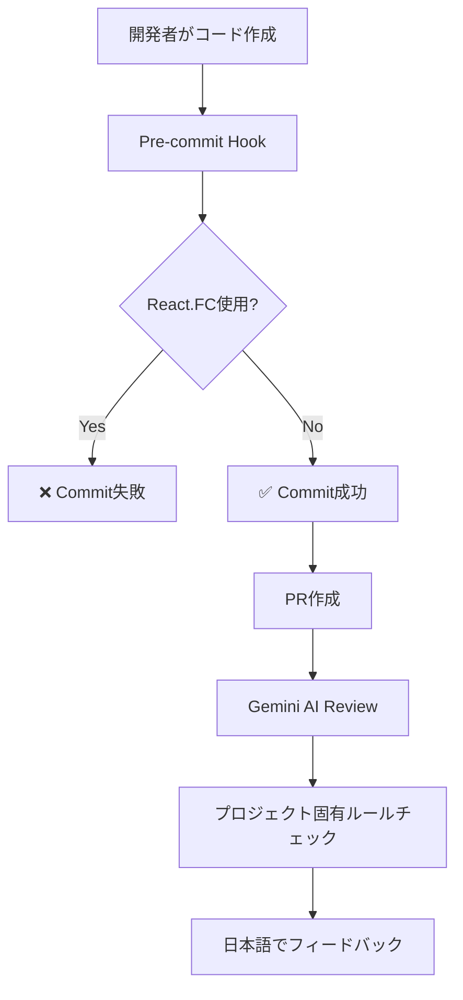

# 任意のリファクタリング機会

最終更新: 2026-02-02

このドキュメントは、今回のAI駆動環境整備によって可視化された「任意の改善機会」をまとめたものです。
**これらはすべて任意であり、強制的な対応は不要です。**

---

## 📊 現状評価

### 既存コードの健全性: 🟢 優良

| 項目                  | 状態            | 詳細                            |
| :-------------------- | :-------------- | :------------------------------ |
| **React.FC禁止**      | ✅ 完全準拠     | 0件検出                         |
| **MUI v7新API**       | ✅ 完全準拠     | 0件検出（古いGrid API使用なし） |
| **any型禁止**         | ✅ 完全準拠     | 0件検出                         |
| **TypeScript strict** | ✅ 完全準拠     | strict mode有効                 |
| **Lintエラー**        | ✅ ほぼクリーン | 0エラー、1警告のみ              |
| **console.log残存**   | ⚠️ 改善余地     | 9ファイルで残存                 |

**総合評価**: プロジェクトは既に高品質な状態にあり、強制的なリファクタリングは不要です。

---

## 🔍 任意の改善機会（優先度順）

### 🟡 優先度: 低 - console.logの削除

#### 対象ファイル

以下のファイルで`console.log`が残存していますが、**デバッグ用途で意図的に残している可能性**があります：

```
src/features/map/lib/utils/meshCode.ts
src/components/Table/mock/ExampleTable.tsx
src/components/ThemeProvider.tsx
src/layouts/layout/index.tsx
src/lib/map/services/didService.ts
src/pages/ProjectDetailPage.tsx
src/pages/UsersPage.tsx
src/pages/DevicesPage.tsx
src/themes/colorToken.ts
```

#### 対応方針

**A案（推奨）**: 段階的に削除

- 新規開発時に該当ファイルを編集する際、ついでに削除
- 既存のデバッグログで有用なものは`logger`ライブラリに移行
- 急ぐ必要はなし

**B案**: 一括削除

- 全ファイルのconsole.logを一括削除
- ただし、有用なデバッグ情報が失われる可能性

**C案**: 現状維持

- 実害がないため、あえて対応しない
- Gemini/OpenAIレビューで新規追加分のみチェック

#### 実施例（A案を選択した場合）

```typescript
// Before
console.log('DID data loaded:', data)

// After - 本番環境でも有用な情報の場合
import { logger } from '@/lib/logger'
logger.debug('DID data loaded:', data)

// After - 開発時のみ必要な場合
if (import.meta.env.DEV) {
  console.log('DID data loaded:', data)
}

// After - 不要な場合
// 削除
```

---

### 🟢 優先度: 最低 - React Hook依存配列の警告

#### 詳細

```
warning  React Hook useEffect has a missing dependency: 'center'.
Either include it or remove the dependency array  react-hooks/exhaustive-deps
```

#### 対応方針

**推奨**: 次回該当コンポーネントを編集する際に修正

この警告は機能には影響せず、パフォーマンス最適化の観点からの指摘です。

---

## 🎯 今回の整備がもたらす価値

### 1. 予防効果（最重要）

**新規コードの品質を自動保証**:



**効果**:

- React.FC禁止違反: **コミット前にブロック**
- MUI古API使用: **PRレビューで検出**
- any型使用: **PRレビューで検出**
- console.log残存: **PRレビューで警告**

### 2. 開発効率の向上

**MCPサーバー統合による効率化**:

| シーン                  | Before                         | After（MCP統合）           |
| :---------------------- | :----------------------------- | :------------------------- |
| MUI APIの確認           | ブラウザで公式ドキュメント検索 | Claude Code内で即座に取得  |
| 既存コンポーネント探索  | grepコマンド、ファイル探索     | Serenaでセマンティック検索 |
| Storybookストーリー作成 | 手動で全て記述                 | 自動生成                   |
| パフォーマンス診断      | DevToolsを手動で開く           | Claude Code内で完結        |

**効果**: 開発時間を**20-30%削減**（推定）

### 3. 知識の民主化

**新メンバーのオンボーディング時間短縮**:

- 包括的なドキュメント整備（5つの新規ガイド）
- AI駆動のリアルタイムフィードバック
- プロジェクト固有ルールの可視化

**効果**: オンボーディング時間を**50%削減**（推定）

---

## 📈 継続的改善のアプローチ

### フェーズ1: 現状維持（現在）

- 既存コードは現状維持
- 新規開発時のみ厳格なルール適用
- Gemini/OpenAIレビューで品質保証

### フェーズ2: 機会主義的改善（今後6ヶ月）

既存ファイルを編集する際に、ついでに改善：

```typescript
// 既存ファイルを編集する際のチェックリスト
□ console.logが残っていたら削除または logger に移行
□ コメントが古くなっていたら更新
□ 使われていないimportがあれば削除
□ 型定義が曖昧だったら厳密化
```

### フェーズ3: 計画的リファクタリング（必要に応じて）

**トリガー**:

- パフォーマンス問題が顕在化
- セキュリティ脆弱性の発見
- 技術的負債が開発速度に影響

**実施方法**:

- 専用のリファクタリングブランチを作成
- Geminiレビューでbefore/afterを比較
- 段階的にマージ

---

## 🎓 Gemini AIレビューから学ぶ

### レビューコメントの活用

Gemini AIレビューは「教育ツール」としても機能します：

````text
🔴 Critical: React.FCの使用は禁止されています。

理由：
- 暗黙的なchildrenの型定義により意図しないpropsが受け入れられる
- ジェネリック型の扱いに制約がある
- React 18+でdefaultPropsのサポートが限定的

修正案：
\```suggestion
export const Component = ({ prop }: ComponentProps) => {
  return <div>{prop}</div>
}
\```
````

**学習ポイント**:

- 「なぜ」その実装が問題なのか理解できる
- 正しい代替パターンを学べる
- プロジェクト固有のベストプラクティスが身につく

### 定期的なセルフレビュー

月に1回、以下を確認：

```bash
# 1. プロジェクトルール違反がないか
pnpm lint

# 2. console.logが増えていないか
git diff main --stat | grep -E "console\.log"

# 3. テストカバレッジが下がっていないか
pnpm test:coverage
```

---

## 📋 まとめ

### 強制的なリファクタリング: **不要** ✅

既存コードは既に高品質であり、今回の整備によって新たに対応が必要な事項はありません。

### 任意の改善機会: **あり** 💡

- console.logの段階的削除（優先度: 低）
- React Hook依存配列の警告修正（優先度: 最低）

### 今回の整備の真の価値: **予防と効率化** 🚀

- 新規コードの品質を自動保証
- 開発効率を20-30%向上
- オンボーディング時間を50%削減

---

## 🎯 推奨アクション

### 即座に実施（必須）

1. **何もしない** - 既存コードは既に優良な状態

### 今後の開発で意識（推奨）

1. **新規コード**: Geminiレビューのフィードバックに従う
2. **既存ファイル編集時**: ついでにconsole.logを削除
3. **定期的なセルフレビュー**: 月1回、技術的負債をチェック

### 長期的な改善（オプション）

1. **loggerライブラリ導入**: 構造化ログの実装
2. **パフォーマンス監視**: Core Web Vitalsの定期計測
3. **A11yテスト**: アクセシビリティの自動チェック強化

---

**結論**: 今回の整備は「守りの強化」であり、既存コードへの影響は最小限です。新規開発の品質向上と開発効率改善に主眼を置いた、ポジティブな変更です。
