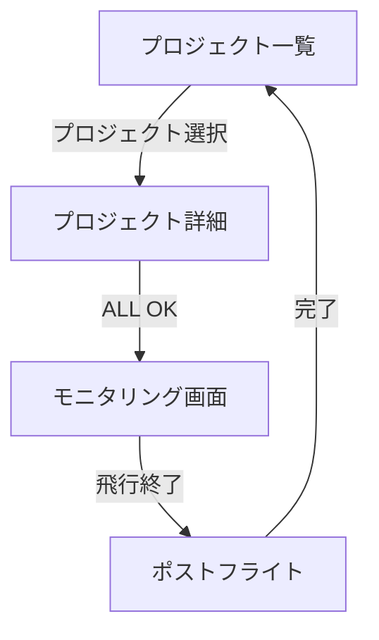
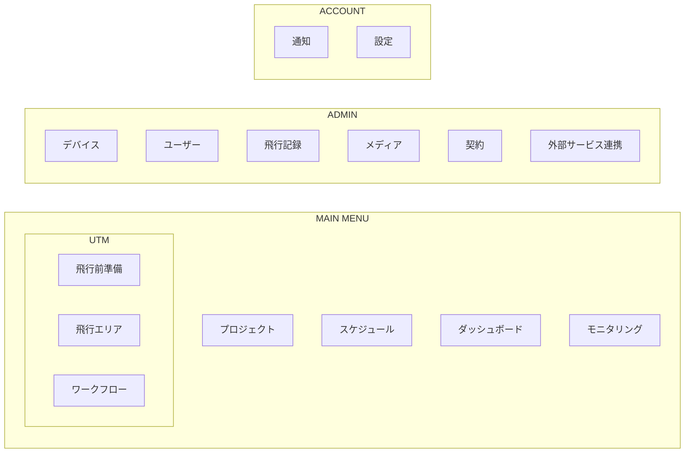
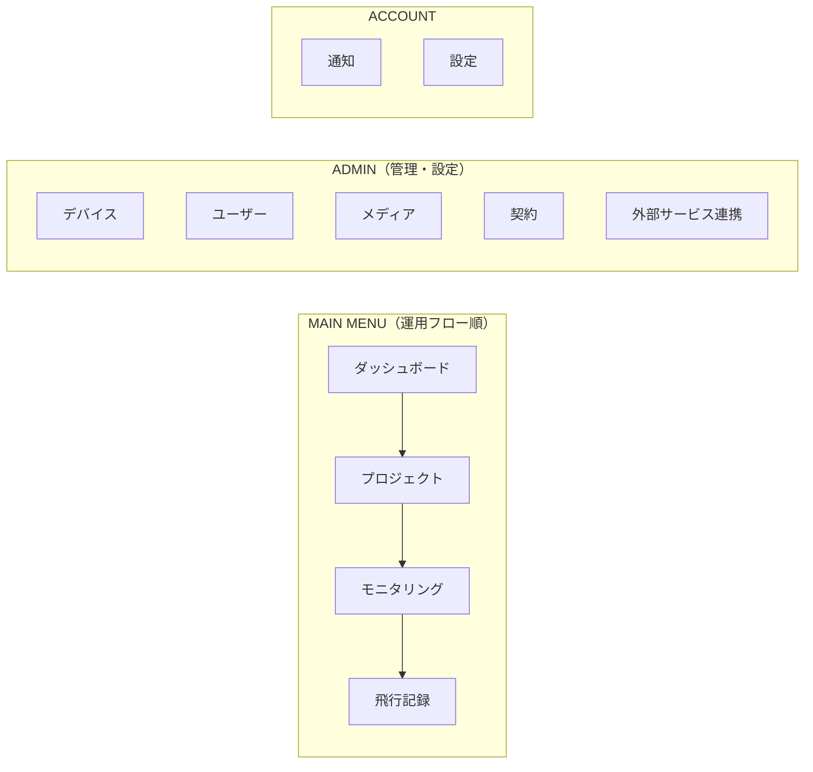
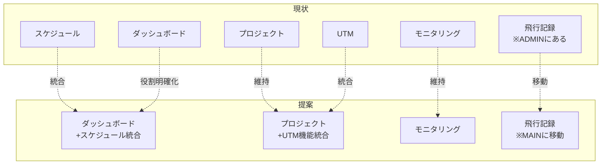
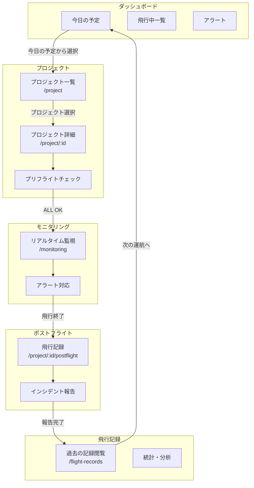

# 運航監視フロー画面遷移図（簡略化版）

## 目次

1. [背景と目的](#背景と目的)
2. [概要](#概要)
3. [画面遷移図](#画面遷移図)
4. [各画面の詳細](#各画面の詳細)
5. [運用シナリオ](#運用シナリオ)
6. [実装に必要なコンポーネント](#実装に必要なコンポーネント)
7. [メニュー構造の提案](#メニュー構造の提案)
8. [将来検討事項](#将来検討事項)

---

## 背景と目的

### 現状の課題

現在のプロダクトには以下の課題がある：

| 課題                           | 詳細                                                       |
| :----------------------------- | :--------------------------------------------------------- |
| **ページ間の孤立**             | 各ページが独立しており、ユーザーフローとして繋がっていない |
| **「ロビー」概念の不明確さ**   | 飛行前の準備・点検がどこで行われるか分散している           |
| **モニタリング画面の位置づけ** | フライト監視専用画面としての役割が不明確                   |
| **スケジュール情報の未整理**   | いつ・誰が・どのタイミングで何を行うかが整理されていない   |

### 本ドキュメントの目的

1. **プロジェクトとロビーの紐付けを明確化**
   - プロジェクト詳細画面を「ロビー（出番前の調整場所）」として定義
   - 飛行前の全ての準備・点検をここに集約

2. **フライトモニタリング専用画面の確立**
   - モニタリング画面を「ステージ（本番）」として明確に位置づけ
   - 複数拠点・複数機体のリアルタイム監視に特化

3. **ページ間の繋がりを確立**
   - プロジェクト一覧 → 詳細（ロビー） → モニタリング → ポストフライト
   - 直線的で迷わないユーザーフローを設計

4. **情報の整理**
   - スケジュール、点検項目、記録・報告を体系的に整理
   - 将来の機能追加（ダッシュボード、ハンドオーバー等）の検討

### 対象範囲

本プラットフォームは**UTM（無人航空機交通管理）に限定せず**、一般的なドローン飛行プロセス全般を対象とする。

#### ドローン飛行の一般的なプロセス

```
計画 → 準備 → 点検 → 飛行 → 監視 → 着陸 → 記録 → 分析
```

| フェーズ | 内容                           | 本プラットフォームでの対応 |
| :------- | :----------------------------- | :------------------------- |
| 計画     | 飛行目的、ルート、日時の決定   | プロジェクト作成           |
| 準備     | 機体選定、バッテリー準備、申請 | プロジェクト詳細           |
| 点検     | プリフライトチェック           | プロジェクト詳細（ロビー） |
| 飛行     | 離陸、ミッション実行           | モニタリング               |
| 監視     | リアルタイム状態監視、異常対応 | モニタリング               |
| 着陸     | 帰還、着陸                     | モニタリング               |
| 記録     | 飛行ログ、インシデント報告     | ポストフライト             |
| 分析     | データ確認、改善点抽出         | 飛行記録                   |

#### 対応する運用パターン

| パターン       | 例                 | 特徴                     |
| :------------- | :----------------- | :----------------------- |
| **定期巡回**   | インフラ点検、警備 | 同一ルートの繰り返し     |
| **緊急対応**   | 災害調査、捜索     | 迅速な準備、柔軟なルート |
| **測量・撮影** | 建設現場、農業     | 精密なルート、大量データ |
| **物流**       | 配送、輸送         | 時間厳守、追跡重視       |
| **実験・開発** | 新機能テスト       | 柔軟な設定、詳細ログ     |

#### UTM固有の機能と汎用機能

| 機能                 | UTM固有 | 汎用 | 備考                     |
| :------------------- | :------ | :--- | :----------------------- |
| 空域管理             | o       | -    | 他機との調整、NOTAM      |
| 飛行計画申請         | o       | -    | 航空局への申請連携       |
| プリフライトチェック | -       | o    | 全てのドローン飛行で必要 |
| リアルタイム監視     | -       | o    | 全てのドローン飛行で必要 |
| 衝突回避             | o       | -    | 複数機体運用時           |
| 飛行記録             | -       | o    | 全てのドローン飛行で必要 |
| 気象確認             | -       | o    | 全てのドローン飛行で必要 |

**設計方針**: 汎用機能をベースに設計し、UTM固有機能はオプションとして追加できる構造とする。

---

## 概要

### コンセプト

運航監視のフローを**3画面 + ポストフライト**に集約し、シンプルで迷わないユーザー体験を実現する。

### 運用の前提

| 項目         | 内容                                                |
| :----------- | :-------------------------------------------------- |
| 監視対象     | **複数拠点の複数機体**を1オペレーターが同時監視     |
| 運航パターン | 単発運航 + **定期運航**（毎日同じルートを飛ぶなど） |
| 記録・報告   | 飛行終了後の記録・報告が**必要**                    |

### 画面構成

| 画面             | 役割                         | 例え                       |
| :--------------- | :--------------------------- | :------------------------- |
| プロジェクト一覧 | プロジェクトを選択           | 出番表                     |
| プロジェクト詳細 | 飛行前の準備・点検を全て完了 | ロビー（出番前の調整場所） |
| モニタリング     | リアルタイム監視・運用       | ステージ（本番）           |
| ポストフライト   | 飛行後の記録・報告           | 楽屋（振り返り）           |

### 主な改善点

| 項目         | 現状             | 提案                     |
| :----------- | :--------------- | :----------------------- |
| 画面数       | 10以上の中間画面 | 4画面に集約              |
| 点検フロー   | 複数画面に分散   | プロジェクト詳細内で完結 |
| 遷移の複雑さ | 多数の分岐・確認 | 直線的なフロー           |
| 飛行後処理   | なし             | ポストフライト画面を追加 |

---

## 画面遷移図



### フロー概要

```
プロジェクト一覧
    ↓ クリック
プロジェクト詳細画面（ロビー）
    ├── 飛行計画の確認
    └── プリフライトチェック
         ├── 気象状態
         ├── バッテリー残量
         ├── 機体コンディション
         ├── 申請状況
         ├── 他機との衝突回避
         ├── 現地確認
         └── その他
    ↓ ALL OK!!
モニタリング画面（飛行スタート）
    ├── 地図（複数拠点のドローン位置表示）
    ├── ステータス一覧（全機体）
    ├── アラート（異常時）
    ├── タイムライン
    └── ログ
    ↓ 飛行終了
ポストフライト画面（振り返り）
    ├── 飛行記録の確認・保存
    ├── バッテリー使用ログ
    ├── インシデント報告（あれば）
    ├── 撮影データのアップロード
    └── 次回飛行の準備状況
    ↓ 完了
プロジェクト一覧へ戻る
```

---

## 各画面の詳細

### 1. プロジェクト一覧

| 項目               | 内容                                    |
| :----------------- | :-------------------------------------- |
| パス               | `/project`                              |
| 役割               | プロジェクトを一覧表示し、選択する      |
| 主要アクション     | プロジェクトをクリック → 詳細画面へ遷移 |
| 既存コンポーネント | `ProjectPage`                           |

#### 表示内容

- プロジェクト名
- 場所/エリア（複数拠点の場合は拠点一覧）
- 予定日時
- ステータス
- **定期運航バッジ**（定期運航の場合）

#### 定期運航の表示

```
┌─────────────────────────────────────────────┐
│ プロジェクト一覧                              │
├─────────────────────────────────────────────┤
│ ┌─────────────────────────────────────────┐ │
│ │ [定期] 能登半島巡回監視                  │ │
│ │ 拠点: 能登A, 能登B, 能登C               │ │
│ │ 次回: 2026/01/31 10:00                  │ │
│ │ ステータス: 準備完了                     │ │
│ └─────────────────────────────────────────┘ │
│ ┌─────────────────────────────────────────┐ │
│ │ 緊急調査: 河川氾濫エリア                 │ │
│ │ 拠点: 新潟A                              │ │
│ │ 予定: 2026/01/31 14:00                  │ │
│ │ ステータス: 点検中                       │ │
│ └─────────────────────────────────────────┘ │
└─────────────────────────────────────────────┘
```

---

### 2. プロジェクト詳細画面

| 項目               | 内容                                           |
| :----------------- | :--------------------------------------------- |
| パス               | `/project/:id`                                 |
| 役割               | 飛行前の全ての準備・点検を行う「ロビー」       |
| 主要アクション     | 全チェック完了後「モニタリング開始」ボタン押下 |
| 既存コンポーネント | `ProjectDetailPage`                            |

#### プリフライトチェック項目

| カテゴリ       | チェック内容                   |
| :------------- | :----------------------------- |
| 気象           | 風速、降水確率、視程、気温     |
| バッテリー     | 残量、健康状態、推定飛行時間   |
| コンディション | 機体状態、センサー、通信状態   |
| 申請           | 飛行許可、NOTAM、空域確認      |
| 他機           | 衝突回避、他のドローン飛行状況 |
| 現地           | 離着陸地点、障害物、人の有無   |

#### 複数拠点対応のUI構成案

```
┌─────────────────────────────────────────────────────────┐
│ プロジェクト詳細: 能登半島巡回監視          [定期運航]   │
├─────────────────────────────────────────────────────────┤
│ 拠点タブ: [能登A] [能登B] [能登C] [全拠点サマリー]      │
├─────────────────────────────────────────────────────────┤
│ ┌─────────────┐  ┌───────────────────────────────────┐ │
│ │   地図      │  │ 飛行計画                          │ │
│ │ [能登A]     │  │ ・機体: QA-1                      │ │
│ │   *        │  │ ・ルート: 海岸線巡回              │ │
│ │             │  │ ・予定時刻: 10:00-11:00           │ │
│ └─────────────┘  └───────────────────────────────────┘ │
├─────────────────────────────────────────────────────────┤
│ プリフライトチェック (能登A)                             │
│ ┌─────────────────────────────────────────────────────┐│
│ │ [x] 気象        OK  (風速: 3m/s, 晴れ)             ││
│ │ [x] バッテリー  OK  (98%, 推定45分)                ││
│ │ [x] コンディション OK  (全センサー正常)            ││
│ │ [x] 申請        OK  (NOTAM確認済)                  ││
│ │ [x] 他機        OK  (周辺飛行なし)                 ││
│ │ [x] 現地        OK  (現地スタッフ確認済)           ││
│ └─────────────────────────────────────────────────────┘│
├─────────────────────────────────────────────────────────┤
│ 全拠点ステータス: 能登A [OK] 能登B [OK] 能登C [確認中]  │
│                                                         │
│              [ モニタリング開始 ]                        │
│               (全拠点OK時のみ有効)                       │
└─────────────────────────────────────────────────────────┘
```

---

### 3. モニタリング画面

| 項目               | 内容                                     |
| :----------------- | :--------------------------------------- |
| パス               | `/monitoring` または `/utm`              |
| 役割               | **複数拠点の複数機体**をリアルタイム監視 |
| 既存コンポーネント | `UTMDashboardPage`, `UTMMultiDroneGrid`  |

#### 複数拠点対応のUI構成案

```
┌────────────────────────────────────────────────────────────────┐
│ モニタリング: 能登半島巡回監視            [設定] [終了] [ログ] │
├────────────────────────────────────────────────────────────────┤
│ 拠点フィルタ: [全て] [能登A] [能登B] [能登C]                   │
├────────────────────────────────────────────────────────────────┤
│ ┌──────────────────────────────┐ ┌───────────────────────────┐│
│ │                              │ │ ステータス (3機)          ││
│ │     地図（広域表示）         │ │ ┌───────────────────────┐││
│ │                              │ │ │ [能登A] QA-1 飛行中   │││
│ │  [能登A]     [能登B]         │ │ │ [能登B] QB-1 待機     │││
│ │    *           *             │ │ │ [能登C] QC-1 警告     │││
│ │         [能登C]              │ │ └───────────────────────┘││
│ │            *                 │ │                           ││
│ │                              │ │ アラート                  ││
│ │                              │ │ ┌───────────────────────┐││
│ │                              │ │ │ [!] QC-1 バッテリー低 │││
│ │                              │ │ │     残り15% 帰還推奨  │││
│ └──────────────────────────────┘ │ └───────────────────────┘││
│                                  └───────────────────────────┘│
├────────────────────────────────────────────────────────────────┤
│ タイムライン                                                   │
│ |--[QA-1開始]--[QB-1開始]--[QC-1開始]--[QA-1着陸予定]-->      │
└────────────────────────────────────────────────────────────────┘
```

#### 主要機能

| 機能           | 説明                                  |
| :------------- | :------------------------------------ |
| 地図表示       | 複数拠点のドローンをリアルタイム表示  |
| 拠点フィルタ   | 特定拠点のみ表示/全拠点表示の切り替え |
| ステータス一覧 | 全機体の状態（飛行中/待機/警告など）  |
| アラート       | 異常発生時の通知と推奨アクション      |
| タイムライン   | 全機体の飛行スケジュール進捗          |
| ログ           | 操作履歴、イベント記録                |

#### 異常時の対応フロー

| 異常           | アラート表示 | 推奨アクション           |
| :------------- | :----------- | :----------------------- |
| バッテリー低下 | 警告（黄）   | 即時帰還を推奨           |
| バッテリー危険 | 危険（赤）   | 強制帰還を実行           |
| 通信途絶       | 危険（赤）   | 自動帰還モード発動を通知 |
| 他機接近       | 警告（黄）   | 回避経路を提案           |
| 気象悪化       | 警告（黄）   | 飛行中止を推奨           |
| 機体異常       | 危険（赤）   | 緊急着陸を指示           |

---

### 4. ポストフライト画面（新規）

| 項目           | 内容                                     |
| :------------- | :--------------------------------------- |
| パス           | `/project/:id/postflight`                |
| 役割           | 飛行終了後の記録・報告を行う             |
| 表示タイミング | モニタリング画面で「飛行終了」を押した後 |

#### 記録・報告項目

| カテゴリ     | 内容                           |
| :----------- | :----------------------------- |
| 飛行記録     | 実際の飛行時間、飛行距離、経路 |
| バッテリー   | 消費量、残量、充電サイクル数   |
| インシデント | 異常発生の有無、内容、対応     |
| 撮影データ   | 写真・動画のアップロード       |
| 機体状態     | 飛行後の機体コンディション     |
| 次回準備     | 次回飛行に向けた準備状況       |

#### UI構成案

```
┌─────────────────────────────────────────────────────────┐
│ ポストフライト: 能登半島巡回監視 (2026/01/31)            │
├─────────────────────────────────────────────────────────┤
│ 拠点タブ: [能登A] [能登B] [能登C] [サマリー]            │
├─────────────────────────────────────────────────────────┤
│ 飛行記録 (能登A - QA-1)                                  │
│ ┌─────────────────────────────────────────────────────┐│
│ │ 飛行時間: 00:45:23                                  ││
│ │ 飛行距離: 12.3km                                    ││
│ │ 最高高度: 120m                                      ││
│ │ 経路完了: 100%                                      ││
│ └─────────────────────────────────────────────────────┘│
├─────────────────────────────────────────────────────────┤
│ バッテリー                                               │
│ ┌─────────────────────────────────────────────────────┐│
│ │ 開始時: 98% → 終了時: 23%                           ││
│ │ 消費: 75%                                           ││
│ │ 充電サイクル: 127回目                               ││
│ │ 健康状態: 良好                                      ││
│ └─────────────────────────────────────────────────────┘│
├─────────────────────────────────────────────────────────┤
│ インシデント報告                                         │
│ ┌─────────────────────────────────────────────────────┐│
│ │ ( ) インシデントなし                                ││
│ │ ( ) インシデントあり → [詳細入力]                   ││
│ └─────────────────────────────────────────────────────┘│
├─────────────────────────────────────────────────────────┤
│ 撮影データ                                               │
│ ┌─────────────────────────────────────────────────────┐│
│ │ [アップロード] 写真: 234枚 / 動画: 2本              ││
│ │ ステータス: アップロード中... 45%                   ││
│ └─────────────────────────────────────────────────────┘│
├─────────────────────────────────────────────────────────┤
│ 次回飛行準備                                             │
│ ┌─────────────────────────────────────────────────────┐│
│ │ [ ] バッテリー充電開始                              ││
│ │ [ ] 機体メンテナンス確認                            ││
│ │ 次回予定: 2026/02/01 10:00 (定期運航)              ││
│ └─────────────────────────────────────────────────────┘│
│                                                         │
│          [ 報告を保存して完了 ]                          │
└─────────────────────────────────────────────────────────┘
```

---

## 運用シナリオ

### シナリオ1: 定期運航（毎日の巡回監視）

```
1. オペレーターが出勤
2. プロジェクト一覧で「定期」バッジのプロジェクトを確認
3. プロジェクト詳細でプリフライトチェックを実施
   - 定期運航の場合、前回の設定が引き継がれている
4. 全拠点OKでモニタリング開始
5. 複数拠点を同時監視
6. 飛行終了後、ポストフライトで記録
7. 翌日の準備状況を確認
```

### シナリオ2: 緊急対応（災害調査など）

```
1. 緊急プロジェクトを新規作成
2. プロジェクト詳細で最低限のチェックを実施
   - 一部項目はスキップ可能（緊急フラグ）
3. モニタリング開始
4. リアルタイムで状況を監視
5. 飛行終了後、ポストフライトで詳細記録
   - インシデント報告が特に重要
```

### シナリオ3: 複数拠点の同時監視

```
1. プロジェクト一覧で複数拠点プロジェクトを選択
2. プロジェクト詳細で各拠点のチェックを実施
   - 拠点タブで切り替え
   - 全拠点サマリーで一括確認
3. 全拠点OKでモニタリング開始
4. 地図で広域表示、必要に応じて拠点フィルタ
5. アラート発生時は該当拠点にフォーカス
6. 全機体着陸後、ポストフライトで各拠点の記録
```

---

## 実装に必要なコンポーネント

### プロジェクト一覧の強化

| コンポーネント       | 説明           | 優先度 |
| :------------------- | :------------- | :----- |
| `ScheduleBadge`      | 定期運航バッジ | 中     |
| `MultiSiteIndicator` | 複数拠点表示   | 中     |

### プロジェクト詳細画面の強化

| コンポーネント          | 説明                     | 優先度 |
| :---------------------- | :----------------------- | :----- |
| `PreflightCheckPanel`   | プリフライトチェック一覧 | 高     |
| `SiteTabNavigation`     | 拠点タブナビゲーション   | 高     |
| `AllSitesSummary`       | 全拠点サマリー           | 高     |
| `WeatherStatusCard`     | 気象状態表示             | 高     |
| `BatteryStatusCard`     | バッテリー状態表示       | 高     |
| `DroneConditionCard`    | 機体コンディション表示   | 高     |
| `ApprovalStatusCard`    | 申請状況表示             | 中     |
| `ConflictCheckCard`     | 他機衝突確認             | 中     |
| `SiteCheckCard`         | 現地確認状況             | 中     |
| `MonitoringStartButton` | モニタリング開始ボタン   | 高     |

### モニタリング画面の強化

| コンポーネント     | 説明                    | 優先度 |
| :----------------- | :---------------------- | :----- |
| `SiteFilterBar`    | 拠点フィルタバー        | 高     |
| `MultiSiteMap`     | 複数拠点地図表示        | 高     |
| `AlertActionPanel` | アラート+推奨アクション | 高     |
| `FlightEndButton`  | 飛行終了ボタン          | 中     |

### ポストフライト画面（新規）

| コンポーネント       | 説明                     | 優先度 |
| :------------------- | :----------------------- | :----- |
| `PostflightPage`     | ポストフライト画面       | 高     |
| `FlightRecordCard`   | 飛行記録カード           | 高     |
| `BatteryReportCard`  | バッテリー報告カード     | 高     |
| `IncidentReportForm` | インシデント報告フォーム | 高     |
| `MediaUploader`      | 撮影データアップローダー | 中     |
| `NextFlightPrep`     | 次回飛行準備チェック     | 中     |

### 既存コンポーネントの活用

| コンポーネント         | 活用方法               |
| :--------------------- | :--------------------- |
| `UTMWeatherWidget`     | 気象情報の表示         |
| `UTMPreflightPanel`    | チェックリストのベース |
| `UTMDroneStatusWidget` | ステータス表示         |
| `UTMAlertPanel`        | アラート表示のベース   |
| `UTMFlightTimeline`    | タイムライン表示       |

---

## メニュー構造の提案

### 現状のメニュー構造と問題点

#### 現状の構造図



現在のサイドバーメニュー：

```
MAIN MENU
├── プロジェクト
├── スケジュール
├── ダッシュボード
├── モニタリング
└── UTM
    ├── [WIP]飛行前準備
    ├── [WIP]飛行エリア
    └── [WIP]ワークフロー

ADMIN
├── デバイス
├── ユーザー
├── 飛行記録
├── メディア
├── 契約
└── 外部サービス連携

ACCOUNT
├── 通知
└── 設定
```

#### 問題点

| 現在のメニュー                    | 問題                                                     |
| :-------------------------------- | :------------------------------------------------------- |
| プロジェクト / UTM                | 関係性が不明確。UTMはプロジェクトの一部？別物？          |
| スケジュール / UTM > ワークフロー | 機能が重複している可能性                                 |
| ダッシュボード / モニタリング     | 違いが分からない                                         |
| UTM > 飛行前準備                  | プロジェクト詳細（ロビー）と同じ機能では？               |
| 飛行記録（ADMIN内）               | ポストフライトの結果なのに管理メニューにある             |
| 全体                              | ユーザーフローが見えない。どこから始めてどこへ行くか不明 |

### 提案：メニュー構造の再編

#### 提案の構造図



#### 変更の比較図



```
MAIN MENU（運用フロー順）
├── ダッシュボード      ← 全体俯瞰（今日の予定、飛行中、アラート）
├── プロジェクト        ← 一覧 → 詳細（ロビー）へ
├── モニタリング        ← 飛行中の監視（ステージ）
└── 飛行記録           ← ポストフライト結果の閲覧

ADMIN（管理・設定）
├── デバイス           ← 機体・ポート管理
├── ユーザー           ← ユーザー管理
├── メディア           ← 撮影データ
├── 契約
└── 外部サービス連携

ACCOUNT
├── 通知
└── 設定
```

### 削除・統合の提案

| 現在               | 提案                   | 理由                                         |
| :----------------- | :--------------------- | :------------------------------------------- |
| スケジュール       | ダッシュボードに統合   | カレンダービューとしてダッシュボード内に配置 |
| UTM > 飛行前準備   | プロジェクト詳細に統合 | ロビー（プロジェクト詳細）で点検を完結       |
| UTM > 飛行エリア   | プロジェクト詳細に統合 | 飛行エリアはプロジェクトの一部               |
| UTM > ワークフロー | 削除                   | フローは画面遷移で自然に表現される           |
| UTM メニュー自体   | 削除                   | 機能はプロジェクト・モニタリングに統合       |

### メニューとユーザーフローの対応



```
ダッシュボード ─────────────────────────────────────────────────
    │ 「今日の予定」から選択
    ↓
プロジェクト（一覧） ─────────────────────────────────────────────
    │ プロジェクト選択
    ↓
プロジェクト（詳細/ロビー）※URLは /project/:id ─────────────────
    │ プリフライトチェック完了
    │ 「モニタリング開始」ボタン
    ↓
モニタリング ─────────────────────────────────────────────────────
    │ 飛行終了
    │ 「飛行終了」ボタン
    ↓
ポストフライト ※URLは /project/:id/postflight ────────────────
    │ 報告完了
    ↓
飛行記録 ─────────────────────────────────────────────────────────
    （過去の飛行記録を閲覧）
```

### 各メニューの役割（再定義）

| メニュー       | 役割           | 主な機能                                               |
| :------------- | :------------- | :----------------------------------------------------- |
| ダッシュボード | 全体俯瞰・起点 | 今日の予定、飛行中一覧、アラート、カレンダー           |
| プロジェクト   | 準備・計画     | プロジェクト一覧、詳細（ロビー）、プリフライトチェック |
| モニタリング   | 監視・運用     | リアルタイム監視、複数拠点表示、アラート対応           |
| 飛行記録       | 記録・分析     | 過去の飛行記録閲覧、統計、レポート                     |

---

## 将来検討事項

### 1. ダッシュボード画面

複数プロジェクトを横断的に俯瞰する画面。

```
ダッシュボード（全体俯瞰）
├── 今日の飛行予定一覧
├── 現在飛行中のドローン（全プロジェクト）
├── アラート一覧（全プロジェクト）
└── 最近の飛行記録サマリー
```

**検討理由**: 複数プロジェクトを同時に管理する場合、個別のプロジェクト詳細に入る前に全体を把握したい場面がある。

### 2. ハンドオーバー（オペレーター間引継ぎ）

オペレーターAからオペレーターBへ監視を引き継ぐ機能。

| ケース     | 説明                                     |
| :--------- | :--------------------------------------- |
| シフト交代 | 勤務時間終了時に次の担当者へ             |
| 緊急対応   | 異常発生時に専門担当者へ                 |
| 負荷分散   | 監視機体が多すぎる時に他のオペレーターへ |

**検討理由**: 複数拠点・複数機体を長時間監視する場合、シフト交代が必要になる可能性がある。

### 3. スケジュール画面

定期運航のスケジュール管理に特化した画面。

```
スケジュール（カレンダー表示）
├── 月間/週間/日間ビュー
├── 定期運航の繰り返し設定
├── 休止日の設定
└── 予定の一括変更
```

**検討理由**: 定期運航が多い場合、カレンダー形式での管理が効率的。

---

## 次のアクション

1. [ ] `PreflightCheckPanel` の詳細設計
2. [ ] `PostflightPage` の詳細設計
3. [ ] 複数拠点対応のワイヤーフレーム作成
4. [ ] Storybookでのプロトタイプ作成
5. [ ] ユーザーテスト実施

---

## 変更履歴

| 日付       | バージョン | 変更内容                                                   | 担当者 |
| :--------- | :--------- | :--------------------------------------------------------- | :----- |
| 2026-01-31 | 2.4.0      | メニュー構造の提案をMermaid図で視覚化                      | -      |
| 2026-01-31 | 2.3.0      | 対象範囲を追加（UTM限定せず汎用ドローン飛行プロセス対応）  | -      |
| 2026-01-31 | 2.2.0      | メニュー構造の提案セクションを追加                         | -      |
| 2026-01-31 | 2.1.0      | ポストフライト、複数拠点対応、定期運航、将来検討事項を追加 | -      |
| 2026-01-30 | 2.0.0      | 3画面構成に簡略化                                          | -      |
| 2026-01-30 | 1.1.0      | Mermaid図をライト/ダークモード両対応に改善                 | -      |
| 2026-01-30 | 1.0.0      | 初版作成（画面遷移図再検討案）                             | -      |
