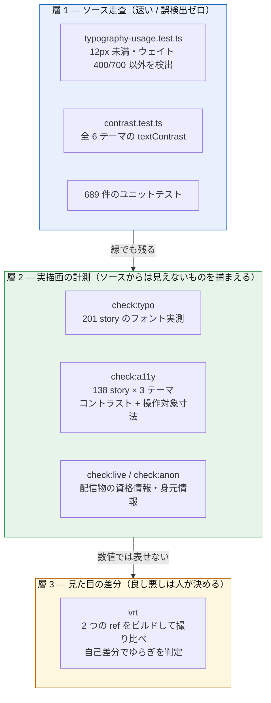

# 品質をどう担保しているか

「規約を決めた」と「規約が守られている」は別物で、その差は毎回**実測してはじめて分かった**。このデザインシステムでは、判定を 3 つの層に分けている。

## 3 層の検証



### なぜ層 1 だけでは足りないか

タイポグラフィ規約を入れたとき、**ソース検査が緑になった時点で実ビルドを測ると 440 箇所が残っていた。**

指定の形式が 1 つではなかったため。実際に 9 種類あった。

```
rem / px / 単位なし数値 / JSX prop / クォート付き文字列 /
CSS / Tailwind クラス / データ配列 / 条件式
```

さらに**ソースからは原理的に見えないもの**が 2 つある。

|                    | 例                                                                       |
| ------------------ | ------------------------------------------------------------------------ |
| ライブラリの既定値 | MUI の Badge / Slider / StepLabel / DataGrid が `fontWeight: 500` を持つ |
| 計算値             | `` `${size * 0.5}px` `` は prop 次第で何 px にもなる                     |

5 回測り直して 440 → 37 → 2 → 1 → 0 と収束させた。

### なぜ層 2 が数値で足りないか

コントラストは**半透明を合成してから測らないと嘘になる**。素の `backgroundColor` を使うと、淡い色を敷いた面の上の文字を実際より低く見積もる（テーブル見出しを 2.56:1 と報告しかけたが、合成すると 5.16:1 だった）。

SVG の文字は `color` ではなく `fill` で描かれ、下地も DOM の祖先ではなく同じ `<svg>` 内の図形。ここを見落として Stepper の現在ステップ（青丸の上の白文字、実際は約 7.4:1）を **1:1 と誤報**した。

## 検出できることを実証する

**この 3 層のどれも「緑を見た」だけでは信用していない。** 導入時に必ず一度壊して、赤くなることを確認している。

| 検査                         | 壊し方                      | 結果                                 |
| ---------------------------- | --------------------------- | ------------------------------------ |
| `check:a11y`（コントラスト） | 閾値を AAA に上げる         | exit 1・5 パターン報告               |
| `check:a11y`（寸法）         | 閾値を 44px に上げる        | exit 1・5 パターン報告               |
| `maxOutputTokens.test`       | Gemini の buffer 分岐を外す | 2 件が落ちる                         |
| `embeddingSearch.test`       | 二重構築の合流を外す        | 1 件が落ちる                         |
| `vrt`                        | —                           | 撮影失敗を id つきで報告するよう修正 |

**この実証をしていなかったために、実際に 2 回見逃した。**

- 検査対象の範囲が広すぎ、overlay の CSS に含まれる文字列を拾って**表示が空でも緑**だった
- 「メッセージが増えたか」しか見ておらず、汎用 FAQ が返っても緑だった

## いま守られているもの（実測値）

|                                                  | 数                                                   |
| ------------------------------------------------ | ---------------------------------------------------- |
| Story                                            | 201（うち部品カテゴリ 138）                          |
| ユニットテスト                                   | 689 件 / 41 ファイル                                 |
| DS 採用率                                        | saas-dashboard 100% / kaze-eats 100% / sky-kaze 100% |
| フォント下限 12px                                | 201 画面で違反 0                                     |
| ウェイト 400/700 のみ                            | 201 画面で違反 0                                     |
| コントラスト（light + dark-kaze + dark-dracula） | 414 回描画で違反 0                                   |
| 操作対象 24×24（WCAG 2.2 SC 2.5.8）              | 約 1,200〜1,300 個で違反 0（※）                      |
| 配信物の資格情報                                 | 13 チャンク / 6 面で 0                               |
| 配信物の身元情報                                 | 225 ファイル / 識別子 11 種で 0                      |

※ 描画回数（414）は story 数 × テーマ数なので毎回同じだが、**操作対象の個数は
実行ごとに動く**（同じ版で 2 回測って 1,237 / 1,297）。hover やアニメーションの
途中で数えた分が乗るため。**「違反 0」が判定で、個数はカバー範囲の目安**として読む。

## 対象から外しているもの（黙って減らさない）

|                                      | 理由                                                         |
| ------------------------------------ | ------------------------------------------------------------ |
| 解説カテゴリ 63 story のコントラスト | 色見本と「悪い例」を意図的に描くため。`--all` で数字は出せる |
| VRT のベースライン画像               | フォント描画がマシン依存。保存せず毎回両方をビルドして比べる |

外した件数は必ず出力する。**「対象外」を黙って減らすと、緑が意味を失う。**

## 検証の弱点

正直に書く。

- **VRT のゆらぎ判定は取りこぼす。** 同じ版で 4 回撮ると 0/0/0/2647px という story がある。5 回引いても全部 0 なら「本物の変化」に誤って昇格する。判定は自己差分の値と併せて読む必要がある
- **`audit:contrast` が測るのはアプリの入口だけ。** 各アプリの `/` を開いて 4 秒待つので、**タブやルートの奥にある画面は一度も測られていない**。実際 sky-kaze を 3 タブ全部測ったら、入口では 0 件だった「配送結果」に追跡番号のオレンジが 2.8:1 で 10 件あった（`logiForeground()` を通さず素の `LOGI_ORANGE` を文字色にしていた）。既定がライトのみなのも同じ弱点で、アプリ内トグルで切り替わるものは `colorScheme` では測れない
- **アプリ 3 つの実画面は CI に載っていない**（起動が要るため）。上の 10 件も CI では緑のままだった
